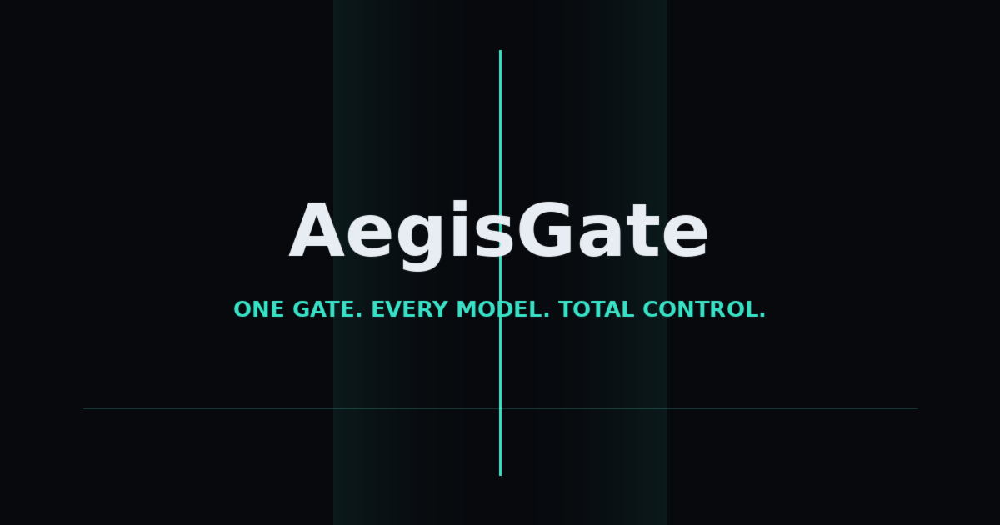

<div align="center">



<br/>
<br/>


# AEGISGATE

### One gate. Every model. Total control.

**Guardrails · Red Teaming · Evaluation — as a service, for any LLM**

[](https://react.dev)
[](https://www.typescriptlang.org)
[](https://vite.dev)
[](https://tailwindcss.com)
[]()
[]()
[]()
[]()

</div>

---

## What is AegisGate?

AegisGate is a **re-engineering of Azure AI Foundry's safety stack** — Content Safety guardrails, the AI Red Teaming Agent (PyRIT), and the Evaluation studio — rebuilt as an independent, **model-agnostic gate-as-a-service**, with the best ideas from Lakera, AWS Bedrock Guardrails, NVIDIA NeMo Guardrails, Cisco AI Defense, and Meta LlamaFirewall folded in.

This repository contains a complete, working **frontend console** with three simulated-but-believable client-side engines (`ScanEngine`, `RedTeamEngine`, `EvalEngine`) that mirror the real API contracts.

```
┌──────────── control plane ────────────┐
│ Policy Studio │ Red Team │ Eval Studio │
└──────────────────┬────────────────────┘
                   │ versioned policy bundle
┌──────────────────▼────── data plane ───┐
│  POST /v1/scan            verdict API  │
│  POST /v1/chat/completions  (gated proxy)│
│  SDKs · LiteLLM · LangChain · Kong/WASM │
└─────────────────────────────────────────┘
```

## Why not just use Azure Foundry?

We back-tracked Foundry and fixed its gaps:

| Foundry limitation | AegisGate answer |
|---|---|
| Prompt Shields return only a boolean | **Subtype + confidence score** on every shield verdict |
| PII is block-or-nothing | **Mask/redact mode** — redact inline and let the request proceed |
| Custom categories can't combine with default harms in one call | **All blocks compose** in a single `/v1/scan` |
| Red-team targets limited to Azure | **Any HTTP endpoint** is a valid target |
| No OWASP/ATLAS mapping in-product | **OWASP LLM Top 10 + MITRE ATLAS** mapped on every scorecard |
| Run comparisons are ephemeral | **Persistent comparisons** with t-test significance badges |
| Advanced features English-only | Multilingual-by-design |

## The Console — 7 surfaces

| Page | What it does |
|---|---|
| **Home** | Cinematic landing — Three.js particle gate, live auto-running scan demo, GSAP-pinned pipeline story |
| **Gate** | Scanner playground: input/output/document/image channels, severity meters (0/2/4/6 like Azure), Prompt Shields with subtype + confidence, PII masking, groundedness spans, raw JSON, View-Code export |
| **Policy Studio** | 8 composable policy blocks, severity band sliders, annotate/block/mask per block, regex blocklist editor, draft-policy live testing, versioned publish + diff, live Policy-as-Code YAML |
| **Red Team Lab** | 4-step scan wizard, 11 risk categories, Easy/Moderate/Difficult strategy tiers (Base64 → Crescendo/TAP), live terminal log, ASR scorecards, risk×complexity heat matrix, judge-reason transcripts, regression-set export |
| **Evaluation Studio** | Evaluator catalog (quality/RAG/safety/agent/composite/custom), run wizard, results drill-down with histograms, persistent baseline comparison with p-values, continuous-eval sampling rules |
| **Observability** | Ticking KPIs, severity/latency/verdict charts, live scan feed, incident queue, OTel GenAI trace waterfall with harvest-to-dataset, alert rules |
| **Integrations** | API keys with one-time reveal, quickstarts, OpenAI-compatible gated proxy, gateway plugin cards, OWASP/ATLAS/NIST/EU AI Act compliance mapping |

## Architecture

```
src/
├── engines/               # the brains (client-side simulation of the real services)
│   ├── ScanEngine.ts      #   → mirrors POST /v1/scan: harms, shields, PII, groundedness
│   ├── RedTeamEngine.ts   #   → seed objectives → converters → judge → ASR scorecard
│   └── EvalEngine.ts      #   → evaluator catalog, metric distributions, p-value compare
├── components/
│   ├── primitives/        # VerdictBadge, SeverityMeter, StatCard, DataTable, CodeBlock…
│   ├── ConsoleShell.tsx   # 240px console sidebar + top bar
│   └── home/              # HeroCanvas (R3F particles), LiveDemo
└── pages/                 # Home · Gate · Policies · RedTeam · Evaluations · Observability · Integrations
```

**Design system:** `#07090D` base · teal `#38E1C6` brand · violet `#9B7BFF` adversarial · Inter + JetBrains Mono · GSAP pinned sequences · Lenis smooth scroll · Framer Motion springs.

## Quickstart

```bash
git clone https://github.com/ranjan-sumit/agentgate.git
cd agentgate
npm install --legacy-peer-deps
npm run dev        # http://localhost:5173
```

```bash
npm run build      # production build → dist/
```

## The API we're designing toward

```bash
curl -X POST https://api.aegisgate.dev/v1/scan \
  -H "Authorization: Bearer $AEGIS_KEY" \
  -d '{ "channel": "input", "policy": "prod-default-v3", "text": "..." }'
```

```json
{
  "verdict": "blocked",
  "prompt_shield": { "attackDetected": true, "subtype": "encoding", "confidence": 0.97 },
  "harm": { "violence": { "severity": 4, "confidence": 0.91 } },
  "pii": { "action": "masked", "masked_text": "My card is [CARD_NUMBER]" },
  "latency_ms": 38
}
```

## Research lineage

Re-engineered from: **Azure AI Content Safety** (`/contentsafety/` surface, severity quantization, Prompt Shields) · **Azure AI Red Teaming Agent + PyRIT** (converters, orchestrators, ASR scorecards) · **azure-ai-evaluation** (evaluator taxonomy, run comparison) · plus ideas from **Bedrock Guardrails** (ApplyGuardrail, PII masking), **NeMo Guardrails** (OpenAI-compatible proxy), **Lakera** (confidence-scored verdicts), **Cisco AI Defense** (red-team → runtime closed loop), **LlamaFirewall** (agent-native rails).

---

<div align="center">
<sub>Built as a deep-research + multi-agent engineering exercise. MIT licensed.</sub>
</div>
